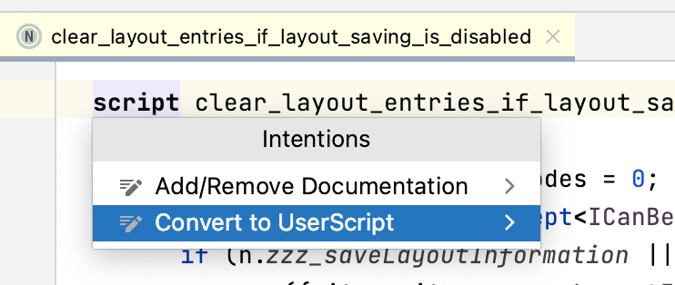
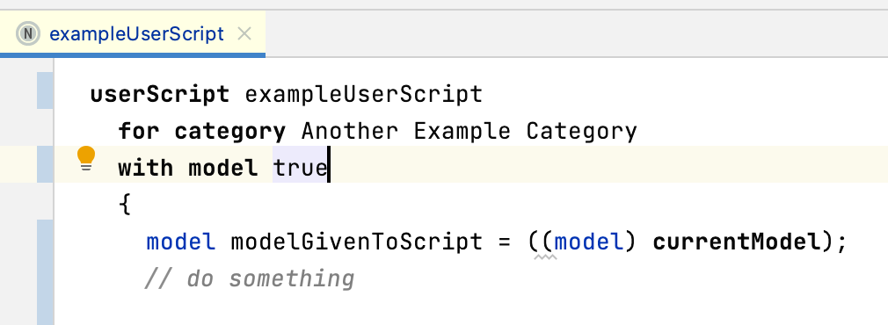
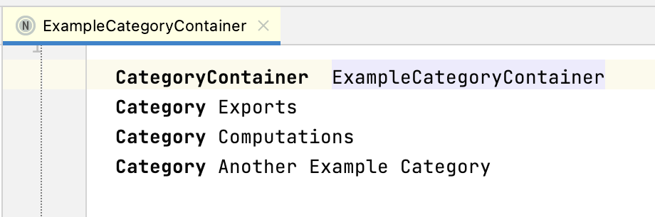
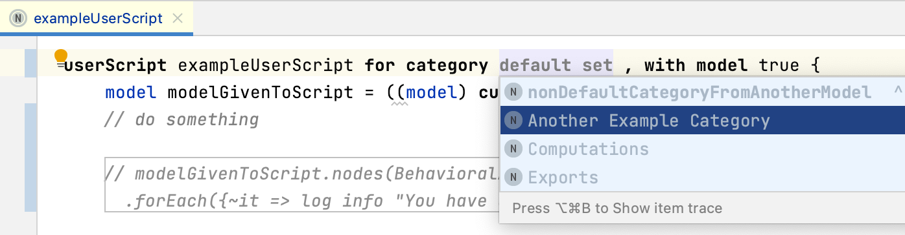
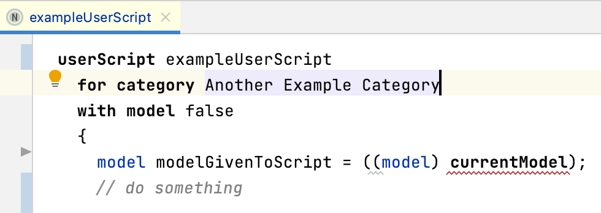

# ArchE Scripts Language
This language is designed to allow users to write `UserScript` and have them available via project view actions menu
## Feature list
* `UserScript` concept - this extends ConsoleScript and provides the necessary references for creating its corresponding action
* `Category` and `CategoryContainer` - provides a mechanism to enable the grouping of scripts within an action popup.
* `ConsoleScript` intention - allows users to convert an existing `ConsoleScript` into a `UserScript`.  For usage, see [intention](#intention)
* `CurrentModel` expression - provides access to the model clicked on in the Project View
* `Model User Scripts` group of actions that require the `currentModel` expression
* `Generic User Scripts` group of actions that do not require the `currentModel` expression

### Intention
To convert an exising ConsoleScript into a UserScript, simply open an existing script, hover over the `script` statement, wait for the intention icon to appear then click on **Convert to Userscript** 

### Using the model in a script
When using the model inside the user script, the expression only resolves correctly once, so the first thing you need to do is assign the result of the `currentModel` expression to a local variable.

After that you can query the local variable

### Script as an Action
Unlike static `action` definitions, this language generates actions on the fly - searches the tree for userScripts and creates an action for each one 

### Categories
The notion of an optional user script **cateogry** has been introduced to allow users to group scripts. For example, by subject or output.
To define categories, simply create the root node 'CategoryContainer' and add your categories

Multiple containers are permitted across a project, and, if imported are not restricted by model or solution scopes.

### `Model` or `Generic` User Script?
What's the difference?
* `Generic` - this is a script that doesn't evaluate the `currentModel` expression.  They can be run from either the `console` or the `right-click` menu in the Project View.
* `Model` - this is a script that evaluates the `currentModel` expression.  These need to be executed by `right-click` on a model within the Project View, otherwise the script will fail.

Until further development is scheduled, a simple boolean solution has been implemented to determine if the script uses the model or not.  
*⚠️* the author of the script is responsible for setting the `with model` property

If `withModel` is false, a constraint prevent use of `currentModel`

